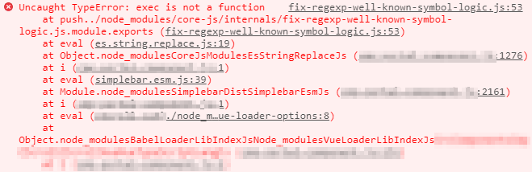

# Babel & core-js (작성중)

개발 로컬 환경에서는 잘 뜨던 화면을 서버에 올리니 갑자기 백화로 표시되는 현상이 발생했다. 로그를 살펴보니 아래와 같이 에러가 찍혀있었다.
(빌드 환경이 달라졌는지 왜 안 됐는지 아직도 잘 모름)

멀쩡하게 잘 사용하던 string replace 함수와 관련된 곳에서 문제가 생기고 있다!? 그리고 babel, core-js 단어도 보이길래 관련 키워드로 검색해본 결과,

Babel에서 사용하는 core-js의 버전이 맞지 않아서 발생하는 문제인 것 같았다. (이미 비슷한 문제를 해결하신 분들 덕분에 해결할 수 있엇다.)

- https://e2xist.tistory.com/741
- https://avaiable.tistory.com/140

## 그렇다면 Babel과 core-js는 어떤 관계?

> Vue 프로젝트에서 발생한 이슈로 아래 내용에는 Vue 내용이 포함되어있을 수 있음

vue cli로 만든 프로젝트에서는 @vue/cli-plugin-babel로 babel 설정해주고 있다.

- babel plugin for vue-cli
- Babel 7 + babel-loader + @vue/babel-preset-app 을 기본으로 사용하고 있음
- babel.config.js에서 다른 Babel preset이나 plugin을 설정해서 사용할 수 있음

### babel-polyfill (Babel 7.4.0 부터 deprecated)

- https://babeljs.io/docs/en/babel-polyfill

Babel은 ES6 문법의 코드를 ES5 환경에서 동작할 수 있게 Syntax 변환을 해준다. (컴파일 타임) 
그러나 ES5에 존재하지 않는 ES6 메서드나 생성자들까지는 코드 변환으로는 해결하기 어렵기 때문에 polyfill을 사용해서 해결해야한다. 그래서 @babel/polyfill이 deprecated 되기 전에는 이 모듈을 사용하기도 했다.
polyfill은 전역 스코프에 추가한다.

### core-js

- polyfill 모듈
- Babel 7.4부터 core-js@3을 같이 사용하는데 default가 core-js 2 이라서 문제가 생겼다.

## 참고

- https://so-so.dev/web/you-dont-know-polyfill/
- https://simsimjae.medium.com/개발을-하다보니-이런-에러가-생겨서-원인을-찾다가-폴리필-문제라는걸-깨닫고-정리합니다-217a207f8181
- https://tech.kakao.com/2020/12/01/frontend-growth-02/
- https://velog.io/@vnthf/corejs3로-대체하자-zok3p9aouy#그래서-core-js3는-어떻게
- https://velog.io/@kwonh/Babel-%ED%8F%B4%EB%A6%AC%ED%95%84polyfill-babelpreset-env
