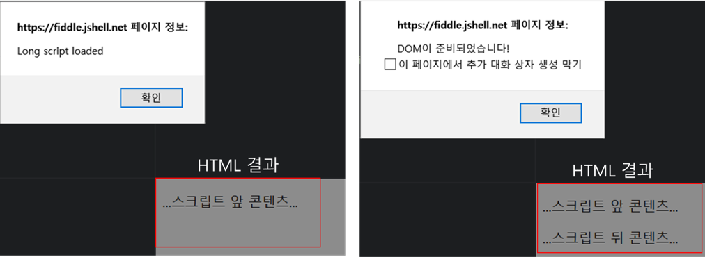
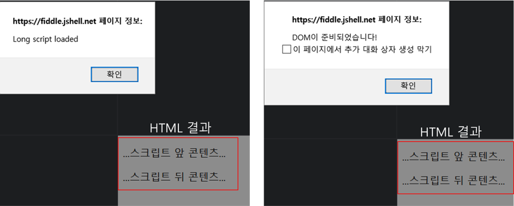

# 스크립트 로드 되었니?

> 스크립트를 동적으로 불러오는 경우에 직접 스크립트 태그를 만들어 로드하도록 했다. 이것과 관련하여 좀 더 알아보자.

[WHATWG](https://html.spec.whatwg.org/multipage/scripting.html#script)을 살펴보면 `<script>` 태그를 이용하여 동적인 스크립트와 데이터를 문서에 포함시키게 할 수 있다고 작성되어있다. (기본!)

기본적으로 아래와 같은 방식으로 스크립트를 추가할 수 있다. (이 외에도 module 형식으로 스크립트를 추가할 수 있는 등 type도 지정할 수 있다.)

```html
<!-- 직접 코드를 입력 할 수도 있음 -->
<script>
    console.log('script');
</script>

<!-- local, remote 스크립트를 불러올 수 있음-->
<script src="./test.js"></script>
```

### 그렇다면 이 스크립트가 로드되는 타이밍은 언제일까?

HTMl 파싱 중 스크립트 태그를 만나는 순간부터는 이 스크립트를 로드하고 실행한다. 이 말은 스크립트 태그 뒤쪽에 있는 페이지의 요소들은 그려지지 못하고 앞쪽 스크립트의 로드/실행이 끝날 때까지 기다려야 한다.

아래 예제를 통해서 각 시점의 스크립트에서 DOM 노드에 접근할 수 있는지를 비교해볼 수 있다.
```html
<!-- https://eager.io/blog/everything-I-know-about-the-script-tag/ 의 예제 -->
<html>
  <head>
    <script>
      // document.head is available
      // document.body is not!
      // 여기서는 body에 선언된 element에 접근이 불가능
      // HTML 파싱 중간에 스크립트 로드 및 실행으로 DOM 생성이 지연
    </script>
  </head>
  <body>
    <script>
      // document.head is available
      // document.body is available
    </script>
  </body>
</html>
```

---
> ### 잠깐 아래 내용을 알아보고 다음으로 넘어간다.

#### HTML 문서의 생명주기 관련 이벤트

* **DOMContentLoaded**: 브라우저가 HTML 전부 로드되고 DOM 트리를 완성하는 즉시 발생한다. (이미지, 스타일 등의 외부 자원들은 기다리지 않는다.)
    - DOM이 준비되었기 때문에 DOM 노드에 접근이 가능
    - document 객체에서 실행
* **load**: DOM 트리도 완성되고 외부 자원도 모두 불러오는 것이 끝났을 때 발생한다.
    - 이미지 크기, 스타일 적용 후 실제 요소의 크기 확인 등이 가능
    - window 객체에서 실행
* **beforeunload/unload**: 사용자가 페이지를 떠날 때 발생한다.
    - beforeunload는 예시로 '정말 이 페이지를 나가시겠습니까?' 이런 체크를 할 때 사용할 수 있다.
    - window 객체에서 발생

**참고** https://ko.javascript.info/onload-ondomcontentloaded

---

### 스크립트가 완전히 로드 된 이후 DOM에 접근해야 할 때

물론 가장 확실한 방법은 위의 예시 코드처럼 body 태그의 가장 아래쪽에 두는 것이다.

하지만 스크립트 태그 위치를 body 하단에 놓지 못하게 되거나 큰 HTML 문서를 다 다운로드 받고 난 다음 스크립트를 다운받으면 너무 느려지게 된다. 이럴 때 아래 2개의 `<script>` 속성으로 스크립트 로딩/실행 시점을 제어해볼 수 있다.

**defer**<br>
`<script defer src="./test.js"></script>` 이렇게 defer 속성을 선언하면 백그라운드에서 스크립트를 다운로드하게 된다. 이 말은 스크립트를 다운로드한다고 파싱이 멈추지 않는다는 것이다. 실행은 페이지 구성이 완료된 이후 이루어진다.
> defer 속성 스크립트는 HTML에 추가된 순으로 실행된다.

**async**<br>
이 속성을 붙이면 페이지와 완전히 독립적으로 동작한다. defer 속성처럼 백그라운드에서 스크립트를 다운로드 한다. 하지만 로드가 완료되고 스크립트가 실행되는데 이때는 파싱이 멈춘다.
> 이 속성은 전체 페이지가 모두 로드되고 다른 스크립트 실행에는 관심이 없다. (독립적으로 다른 코드에 영향을 안 주는 것들, 예를 들어 방문자 수 카운터 등과 같이) 그래서 async 스크립트가 여러개 있을 경우 다운로드가 완료된 순서대로 스크립트를 실행하게 된다.

> 아래 [WHATWG 스펙](https://html.spec.whatwg.org/multipage/scripting.html#script)의 스크립트 로드 시점을 이해하기 좋은 그림


### 스크립트와 DOMContentLoaded 이벤트

기본적으로 HTML 파싱 도중 `<script>` 태그를 만나면 파싱이 멈추고 스크립트를 실행한다. 이 때 스크립트가 모두 실행되고 난 후 DOMContentLoaded 이벤트가 발생한다.

**예시** (모던자바스크립트 튜토리얼의 예시를 응용)
```html
<!doctype html>
<body>
    <script>
    document.addEventListener("DOMContentLoaded", () => {
        alert("DOM이 준비되었습니다!");
    });

    </script>
    <p>...스크립트 앞 콘텐츠...</p>

    <script src="https://javascript.info/article/script-async-defer/long.js?speed=1"></script>

    <p>...스크립트 뒤 콘텐츠...</p>
</body>
```
위 코드의 결과는 다음과 같다.



스크립트 수행을 위해 HTML 파싱을 멈추었고 그 후 DOM 생성을 완료하고 DOMContentLoaded 이벤트가 발생한다.

#### 만약 중간 스크립트에 defer 속성을 추가하게 되면 어떻게 될까?


그림에서 볼 수 있듯이 파싱이 중단되지 않고 모두 그려지고 스크립트가 실행 된 다음 DOMContentLoaded 이벤트가 발생한다.
- 페이지는 지연되지 않고 바로 그려진다.
- 지연된 스크립트는 DOM이 완성되고 실행된다.
- 그 다음 DOMContentLoaded 이벤트가 발생한다.

#### async 속성 스크립트와 DOMContentLoaded 이벤트는?
DOMContentLoaded 이벤트와 async 스크립트는 서로 기다리지 않는다. 그래서 async 스크립트 전, 후 언제 실행될지 예측할 수 없다.
- DOM 완성 이후 스크립트 다운로드 완료: DOMContentLoaded 이벤트가 스크립트 실행보다 먼저 일어날 수 있음
- (DOM 완성 전) 스크립트 다운로드 완료: 스크립트 실행 후 DOMContentLoaded 발생할 수 있음

### 동적으로 스크립트 추가
`let script = document.createElement('script');`
이렇게 동적으로 스크립트 원소를 만들고 document 객체에 관련 요소를 추가해주면 다운로드가 시작된다. 그런데 이렇게 추가하면 기본적으로 async 속성 스크립트처럼 동작한다. (`script.async = false;`를 설정해주면 추가된 순서대로 실행시킬 수 있다.)

### 참고
* [모던자바스크립트 튜토리얼-defer, async 스크립트](https://ko.javascript.info/script-async-defer)
* [모던자바스크립트 튜토리얼-HTML문서 관련 이벤트](https://ko.javascript.info/onload-ondomcontentloaded)
* [스크립트 태그에 대해 잘 정리되어있는 블로그](https://eager.io/blog/everything-I-know-about-the-script-tag/)
* [스크립트 위치에 대해 잘 정리되어있는 문서](https://velog.io/@takeknowledge/script-%ED%83%9C%EA%B7%B8%EB%8A%94-%EC%96%B4%EB%94%94%EC%97%90-%EC%9C%84%EC%B9%98%ED%95%B4%EC%95%BC-%ED%95%A0%EA%B9%8C%EC%9A%94)

* [GeeksforGeeks - Difference between DOMContentLoaded and load Events](https://www.geeksforgeeks.org/difference-between-domcontentloaded-and-load-events/)
* [async, defer 언제 쓰면 좋을지 정리되어있는 글](https://zellwk.com/blog/javascript-async-and-defer/)