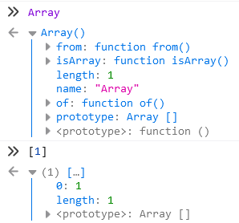

# JavaScript Array
> 내장 함수

배열, 객체, 함수, 정규식 값은 리터럴 형태로 생성하는 것이 일반적이지만, 리터럴은 생성자 형식으로 만든 것과 동일한 종류의 객체를 생성한다. 그래도 생성자는 안 쓰는게 좋다.

생성자를 쓴다면 Array() 생성자 앞에 new를 붙이지 않아도 붙인 것처럼 작동한다.

```js
let arr1 = new Array(1, 2, 3); // === Array(1, 2, 3);
arr1; // [1, 2, 3]
```
arr1에는 예상한 배열이 들어가있다. <br>
그런데 아래 arr2는 이상하다.
```js
let arr2 = new Array(3); 
// 크기가 3이고 값이 없는 배열이 생성되어있다.
arr2.length; // 3
arr2; // Firefox 표현: Array(3) [ <3 empty slots> ]
      // Chrome 표현 : (3) [empty × 3] 
      // 브라우저 별로도 표현하는 방식이 다름
```
Array 생성자는 숫자 하나만 받으면 그 숫자를 원소로 하는 배열을 생성하는 것이 아니다. 위처럼 이상한 일이 발생하기 때문에 가능한 생성자를 쓰지 말라고 한다.
> 참고) Array.of()로 이 이상한 상황을 벗어날 수 있다.

## 프로토타입
내장 네이티브 생성자는 각자의 .prototype 객체를 가진다. `Array.prototype` 처럼. prototype 객체에는 해당 객체의 하위 타입별로 고유한 로직이 담겨있다.

## 2차원 배열 만들기
> 이거 할려고 정리하기 시작했다.

for문 2번 돌면서 만드는 방법이 가장 먼저 떠오르긴 하지만 더 좋아보이는 방법이 있을 것 같았다.

`Array.from()`으로 만들 수 있다는 사실을 알게 되었다.

### Array.from()
이 메서드는 유사 배열 객체나 반복 가능한 객체를 얕게 복사해 새로운 Array 객체를 만든다. Static Method이며 ES6에서 추가되었다. 

이런게 된다.
```js
let strArr = Array.from('abcd');
strArr; // Array(4) [ "a", "b", "c", "d" ]
```

그럼 내가 만들고 싶은 2차원 배열을 만들어보자.
```js
let multiArr = Array.from(
    { length: 3 }, // 유사 배열 객체 (length 프로퍼티와 인덱스 원소가 있는 객체)
    () => []
);
// 크기가 3인 배열의 각 원소에 빈 배열로 초기화하는 배열을 생성
```


## 참고
* You don't know JS - 타입과 문법, 스코프와 클로저
    > You don't know JS에서 말하는 <b>네이티브</b>란 특정 환경에 종속되지 않은 ECMAPScript 명세의 내장 객체를 의미

* [You don't know JS -ES6 & Beyond - Array.from()](https://github.com/getify/You-Dont-Know-JS/blob/1st-ed/es6%20%26%20beyond/ch6.md)
    > Array.of()를 언제 사용하면 좋은지에 대해서 설명하고 있는데 꼭 참고할 것

* [MDN - Array.from()](https://developer.mozilla.org/ko/docs/Web/JavaScript/Reference/Global_Objects/Array/from)

* [유사 배열을 배열로 만드는 예제](https://medium.com/@bgh3470/javascript-es6-array-of-array-form-99268eb82a2b)

* [Array.from을 통한 배열의 초기화](https://velog.io/@teihong93/Array.from%EC%9D%84-%ED%86%B5%ED%95%9C-%EB%B0%B0%EC%97%B4%EC%9D%98-%EC%B4%88%EA%B8%B0%ED%99%94)

* [Static에 대해서 - MDN](https://developer.mozilla.org/en-US/docs/Web/JavaScript/Reference/Classes/static)
* [Static에 대해서 - 모던 자바스크립트 튜토리얼](https://ko.javascript.info/static-properties-methods)
    > Static method는 특정 클래스 인스턴스가 아닌 클래스 전체에 필요한 기능을 만들 때 사용할 수 있다.

    > Array의 static method로 예로 from, of가 들어있다. 그런데 리터럴로 만든 배열에는 static method가 없다. 그래서 정리해보면 from이나 of는 특정 배열에서 필요로 하는 기능이 아니라 Array 전체 필요한 기능으로 내장되어 있어 새로운 배열을 반환한다. (이건 나만의 정리)

    
    > *Firefox 콘솔에서 찍어본 내용*