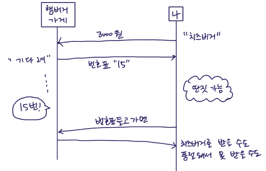

# 비동기 상황을 해결해보자
> Callback, Promise, async/await <br>
> 자바스크립트에서 비동기 상황을 어떻게 해결하는지 살펴본다.

## 비동기?
같은 시점에 발생하지 않는 상황이다. 예를 들면 사용자로부터 입력을 기다리거나 데이터를 DB나 네트워크를 통해서 받아와야 할 때 동시에 수행할 수 없다. You don't know JS에서는 "현재 그리고 지금 실행되지 않고 있는 나중 사이의 갭"이라고 표현한다. 그리고 현재와 나중, 이 관계를 비동기 프로그래밍 (Asynchronous programming)의 핵심이라고 말한다. 

```js
let data = loadData(url); // loadData는 async 함수
console.log(data); // 만약 loadData로부터 값을 전달받지 못했다면 undefined가 출력될 것
```

어떻게 비동기 상황을 해결할 수 있을까?

## Callback (콜백)
> "처리 끝나고 나면 다음에 이거 실행시켜줘"

```js
// loadData라는 함수 내에서 url을 가지고 데이터 불러오기를 성공하고 callback으로 전달받은 함수를 실행
loadData(url, function(data) {
    console.log(data);
});
```

### 콜백 지옥
```js
// 점점 더 깊어질수도 있음
// 좋은 코딩 방식이 아님
loadData(url, function(data) {
    console.log('data');
    loadAnother(data, function(){
        console.log('another');
    });
});
```

## Promise (프라미스)
> 콜백 지옥도 해결하고 콜백을 누군가한테 넘겨서 대신 수행하는 방식을 피해보자


성공이든 실패든 어떤 결과을 넘겨줄 것이라는 약속을 한다. 

```js
function delay(time) {
    return new Promise(function(resolve, reject) {
        setTimeout(() => resolve(time), time);
    });
})

// 체이닝
delay(100)
.then( // promise.then을 호출하면 프라미스가 반환 -> 또 then을 호출할 수 있음
    function(result) {
        // Fulfillment
        console.log(result); // 100
        return result * 2; 
    },
    function(error) {
        // Reject
    }
) // then의 결과를 체인 아래로 전달
.then(function(result) {
    console.log(result); // 200
    return result * 2;
});
```

### Error Handling
.catch로 프라미스에서 발생한 에러를 처리한다. 여러 then 중간에 발생한 에러를 마지막 catch에서 처리한다.
```js
promise()
.then()
.then()
.catch()
```

## async await
> 프라미스를 좀 더 편리하게 사용해보자

function 앞에 async를 붙이면 항상 프라미스가 반환된다.
```js
async function A() {
    return 'A'; // 프라미스로 감싸서 반환
}
```

async 함수 안에서만 동작하는 await 키워드는 프라미스가 처리될 때까지 기다린다.
```js
async function load() {
    let result = await fetch();
    return result;
}
```

에러는 try..catch를 사용해 잡을 수 있다.


## 참고
* [You don't know JS: Aysnc & Performance](https://github.com/getify/You-Dont-Know-JS/blob/1st-ed/async%20&%20performance/README.md#you-dont-know-js-async--performance)

> ※ Parallel은 동시에 일어날 수 있는 것인데 JS는 single thread이기 때문에 mulit thread 환경에서 발생할 수 있는 데이터 공유 등의 문제는 걱정하지 않아도 된다. JS는 "run-to-completion"으로 수행되기 때문에 함수 내 코드는 atomic 하게 수행된다. A라는 함수가 모두 수행되어야 다른 함수가 수행된다는 것이다.

* [모던 자바스크립트 튜토리얼 - 프라미스와 async, await](https://ko.javascript.info/async)

* [정리가 잘 되어있는 글 1](https://blog.sessionstack.com/how-javascript-works-event-loop-and-the-rise-of-async-programming-5-ways-to-better-coding-with-2f077c4438b5)

* [정리가 잘 되어있는 글 2](https://blog.naver.com/pjt3591oo/222204144528
)