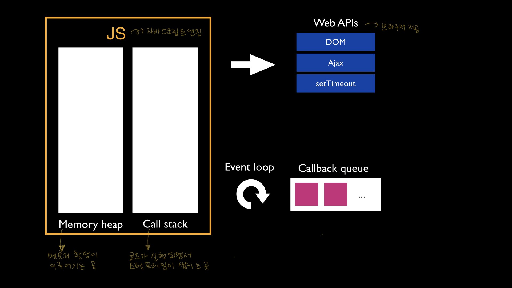
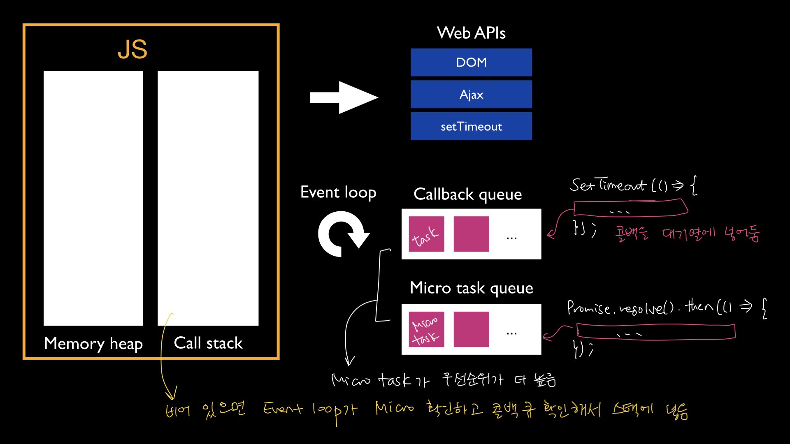

# 자바스크립트는 어떻게 코드를 실행할까?

자바스크립트는 single thread로 동작한다. 이 말은 한번에 한가지 일 밖에 하지 못한다는 것이다. 그래서 만약 코드 실행 중에 오래 걸리는 일, 예를 들어 네트워크나 I/O를 통해야 할 때 이 일을 처리하는 동안 브라우저는 아무것도 하지 못하고 멈출 수 밖에 없다. 이를 해결하기 위해 자바스크립트는 콜백을 통해 비동기 동작이 가능하도록 했다.
> 구체적으로 어떻게 비동기 상황을 처리할 수 있는지는 [여기](https://github.com/kuongee/my-js/blob/main/JavaScript/asynchronus.md)를 참고해보자.

## Event Loop

하나의 공통 'thread'만을 가진 환경에서 자바스크립트 엔진이 어떻게 비동기 동작이 가능하게 되는 걸까? 사실 JS 엔진이 비동기 동작을 위해 특별히 하는 것은 없다. **Event Loop**가 비동기적으로 동작하게 하는 담당을 맡고 있다.

Event loop는 콜백 큐와 마이크로태스크 큐를 살펴보면서 스택이 빌 때마다 큐에서 태스크를 꺼내 스택에 넣어서 실행되도록 한다. 콜백 큐와 마이크로태스크 큐의 우선순위를 비교하면 마이크로태스크 큐가 더 크다. 여기서 만약 requestAnimationFrame이 끼어든다면 Micro Task > rAF > Macro Task 순의 우선순위로 동작하게 된다.

## 참고
* 직접 그린 그림

* [이벤트루프 관련 영상보고 직접 정리한 내용](https://github.com/kuongee/my-js/blob/main/JavaScript/eventLoop.md)

* [스펙](https://html.spec.whatwg.org/multipage/webappapis.html#event-loops)
* [MDN 동시성 모델과 이벤트 루프](https://developer.mozilla.org/ko/docs/Web/JavaScript/EventLoop)
* [모던 자바스크립트 튜토리얼 - 마이크로태스크](https://ko.javascript.info/microtask-queue)
* [모던 자바스크립트 튜토리얼 - 이벤트 루프](https://ko.javascript.info/event-loop)
* [Don’t block the event loop! 매끄러운 경험을 위한 JavaScript 비동기 처리](https://engineering.linecorp.com/ko/blog/dont-block-the-event-loop/)
* [JavaScript Visualized: Event Loop](https://dev.to/lydiahallie/javascript-visualized-event-loop-3dif)
* [자바스크립트 이벤트](https://medium.com/%EC%98%A4%EB%8A%98%EC%9D%98-%ED%94%84%EB%A1%9C%EA%B7%B8%EB%9E%98%EB%B0%8D/%EC%9E%90%EB%B0%94%EC%8A%A4%ED%81%AC%EB%A6%BD%ED%8A%B8-%EC%9D%B4%EB%B2%A4%ED%8A%B8-%EC%A0%9C%EB%8C%80%EB%A1%9C-%EC%9D%B4%ED%95%B4%ED%95%98%EA%B8%B0-part-1-2a7d4b9eb468)
* [Macrotasks, microtasks, execution contexts, event queues, and rAF](https://medium.com/%EC%98%A4%EB%8A%98%EC%9D%98-%ED%94%84%EB%A1%9C%EA%B7%B8%EB%9E%98%EB%B0%8D/%EC%9E%90%EB%B0%94%EC%8A%A4%ED%81%AC%EB%A6%BD%ED%8A%B8-%EC%9D%B4%EB%B2%A4%ED%8A%B8-%EC%A0%9C%EB%8C%80%EB%A1%9C-%EC%9D%B4%ED%95%B4%ED%95%98%EA%B8%B0-part-1-2a7d4b9eb468)