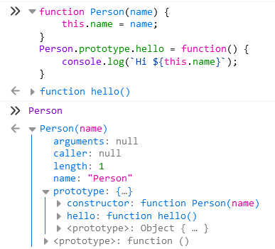

#  객체 만들기
> 객체를 생성하는 여러 방법을 소개한다.

자바스크립트의 자료형 중 객체형은 하나의 데이터 (string, number 등) 만 담을 수 있는 원시형과는 달리 다양한 데이터를 담을 수 있다. 

Key로 구분된 데이터 집합이나 복잡한 개체를 저장할 수 있다.
Key에는 문자형, value는 모든 자료형이 올 수 있다.

## 객체 생성하기
### 객체 리터럴 (object literal)
객체는 중괄호를 이용해 아래처럼 선언할 수 있다.
```js
// 객체 리터럴 - 중괄호를 이용해 객체를 선언
{
    key1: value1,
    key2: value2,
}
```
비슷한 객체들이 필요할 때 아래와 같이 코드를 작성할 수도 있겠지만 중복된 내용이 발생하고 있다.
```js
const james = {
    name: 'James',
    hi() {
        console.log(`Hi ${this.name}`);
    }
};

const jane = {
    name: 'Jane',
    hi() {
        console.log(`Hi ${this.name}`);
    }
};
```

### new 연산자 & 생성자 함수

new 연산자와 생성자함수로 유사한 객체 여러 개를 쉽게 만들어낼 수 있다.<br>
생성자 함수는 일반 함수랑 똑같이 생겼지만 지켜야할 약속 2가지가 있다.
1. 함수의 이름의 첫글자는 대 문자로 시작
2. 'new' 연산자를 붙여 실행

```js
function Person(name) {
    this.name = name;
    this.hi = function() {
        console.log(`Hi ${this.name}`);
    }
}
```
Person 함수를 new 연산자 없이 실행시킬 수 있지만 undefined가 반환되기 때문에 에러가 발생한다.
```js
const test = Person('name');
test.hi(); // -> 에러 발생
```

new 연산자를 이용하여 함수를 실행시켜보자.
```js
const jane = new Person('Jane');

// 무슨 일이 벌어질까?
function Person(name) {
    // this = {}; -> 빈 객체가 암시적으로 만들어짐
    
    // 새로운 프로퍼티를 this에 추가함
    this.name = name;
    this.hi = function() {
        console.log(`Hi ${this.name}`);
    }
    // return this; -> this가 암시적으로 반환됨
}

// 결론적으로 아래 코드와 동일하게 동작한다는 것
const jane = {
    name: 'Jane',
    hi() {
        console.log(`Hi ${this.name}`);
    }
};
```
new 연산자와 생성자 함수를 이용하여 유사한 객체를 일일이 만들지 않고 간단하게 재사용하여 만들 수 있게 되었다.

위에서 일일이 객체를 만드는 것보다 코드가 훨씬 간결해졌다.
```js
const james = new Person('James';)
const jane = new Person('Jane');
```
하지만! 여기서 한번 더 고민해볼 것이 있다.
james와 jane 객체에는 hi라는 똑같은 함수를 가지고 있다.
수많은 객체들이 생성되고 내부 함수에 코드의 양이 많다면 불필요하게 중복되어 있을 것이다.

## Prototype으로 확장해보자
```js
function Person(name) {
    this.name = name;
}
Person.prototype.hello = function() {
    console.log(`Hi ${this.name}`);
}
```


이렇게 프로토타입으로 선언하고 jane을 만들어본다.
```js
const jane = new Person('jane');
console.log(jane); // Object { name: "jane" }
// jane을 출력하면 hello 프로퍼티는 보이지 않는다.

jane.hello(); // Hi jane
// 정상동작한다.
```
jane의 hello를 호출할 때  현재 객체에서 찾을 수가 없다면 자바스크립트는 프로토타입을 타고 올라가서 찾는다.

## ES6 클래스로 만들어보자
자바스크립트는 다른 언어들의 클래스처럼 사용할 수 있도록 클래스가 있다.<br> 진짜 클래스라기보다는 function으로 만들던 것을 좀 더 쉽게 만들 수 있는 syntatic sugar (편의 문법) 정도로 생각되기도 한다. 실제로 class의 typeof를 확인해보면 "function"으로 나온다.<br>
그래도 클래스를 이용해서 간단하게 객체 지향 프로그래밍에서 사용되는 다양한 기능을 사용해볼 수 있고 class로 선언된 함수를 new 연산자와 함께 호출하지 않으면 에러가 발생하기 때문에 일반 함수와는 다르다.

```js
class Person {
    constructor(name) {
        // constructor에서 정의된 것은 생성될 객체 모두에게 정의됨
        this.name = name;
    }

    // constructor 외부에서 선언된 것은 prototype으로 선언한 것과 동일
    hello() {
        console.log(`Hi ${this.name}`);
    }
}

// class 코드를 babel에서 돌려보면 이렇게 변환된 코드를 볼 수 있다.
var Person = /*#__PURE__*/function () {
  function Person(name) {
    _classCallCheck(this, Person);

    this.name = name;
  }

  _createClass(Person, [{
    key: "hello",
    value: function hello() {
      console.log("Hi ".concat(this.name));
    }
  }]);

  return Person;
}();
```

## 참고
* 위 코드들은 아래에서 참고하여 개인적으로 연습하며 작성
* poiemaweb.com
* 모던 자바스크립트 튜토리얼 - 프로토타입, 클래스
* https://velog.io/@wolverine/자바스크립트-Object-Constructor-Prototype-Class
* https://github.com/getify/You-Dont-Know-JS/blob/1st-ed/this%20&%20object%20prototypes/README.md#you-dont-know-js-this--object-prototypes
